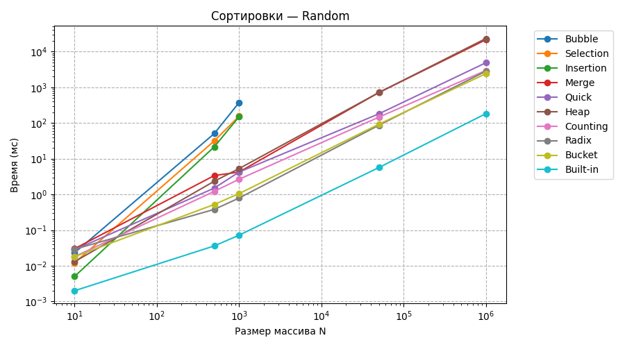
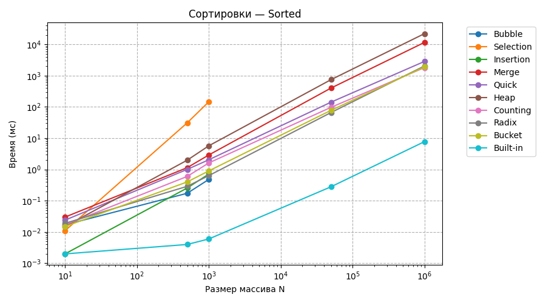
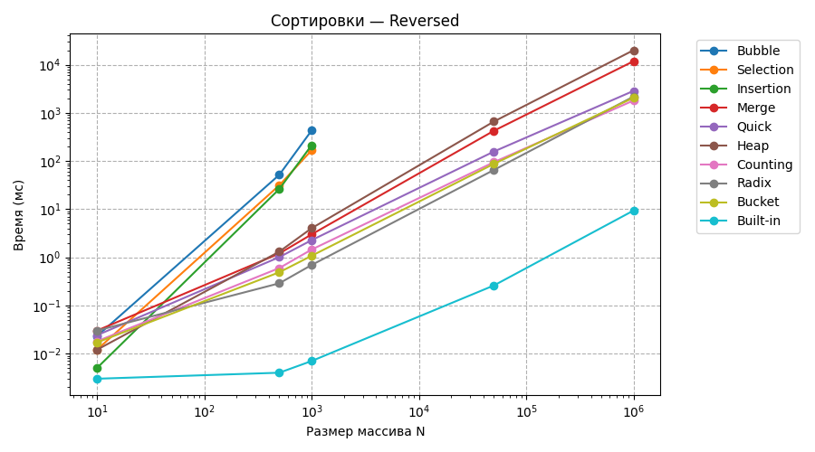
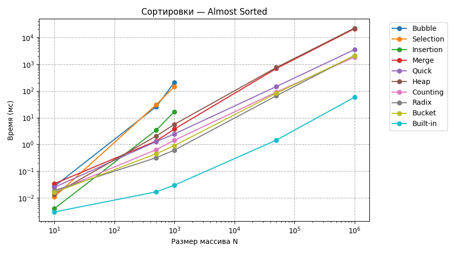

# Отчет по практической работе: Анализ алгоритмов сортировки

## 1. Характеристики машины

| Компонент | Значение |
| :--- | :--- |
| **Модель ПК** | Machenike L15 Light |
| **Процессор** | Intel Core i5-12450H |
| **Оперативная память** | 16 ГБ DDR5 |
| **Ядра/потоки** | 8 ядер / 12 потоков | 
| **Накопитель** | NVme ssd 512 gb, sata ssd 1tb |
| **ОС / Интерпретаторы** | Windows 11 / CPython 3.12, PyPy 7.3 |

---

## 2. Результаты измерений 

### 1. Случайные данные (Random)

| ОС | Интерпретатор | Алгоритм | N=10 (мс / КБ) | N=500 (мс / КБ) | N=1000 (мс / КБ) | N=50000 (мс / КБ) | N=1000000 (мс / КБ) |
|---|---|---|---|---|---|---|---|
| Win | CPython | Bubble | 0.023 / 0.188 | 50.5 / 4.137 | 371.674 / 8.074 | N/A | N/A |
| Win | CPython | Selection | 0.012 / 0.188 | 31.426 / 4.137 | 154.584 / 8.074 | N/A | N/A |
| Win | CPython | Insertion | 0.005 / 0.156 | 21.49 / 4.043 | 149.128 / 7.949 | N/A | N/A |
| Win | CPython | Merge | 0.03 / 0.258 | 3.364 / 8.273 | 4.227 / 16.844 | 711.811 / 861.781 | 21460.574 / 16390.031 |     
| Win | CPython | Quick | 0.028 / 0.43 | 1.501 / 20.508 | 4.213 / 35.867 | 180.105 / 1651.633 | 4868.763 / 57464.172 |    
| Win | CPython | Heap | 0.013 / 0.391 | 2.337 / 4.387 | 5.277 / 8.355 | 709.807 / 391.543 | 23215.952 / 7813.668 |       
| Win | CPython | Counting | 0.018 / 0.391 | 1.215 / 21.441 | 2.653 / 45.824 | 145.559 / 2438.473 | 2955.036 / 48548.262 |
| Win | CPython | Radix | 0.029 / 0.758 | 0.38 / 12.781 | 0.789 / 25.906 | 86.293 / 1302.0 | 2818.506 / 24812.188 |       
| Win | CPython | Bucket | 0.018 / 0.383 | 0.523 / 10.031 | 1.05 / 22.062 | 92.286 / 1269.055 | 2404.544 / 24902.812 |    
| Win | CPython | Built-in | 0.002 / 0.148 | 0.036 / 3.977 | 0.072 / 11.758 | 5.637 / 585.93 | 182.69 / 11718.57 |        
| Win | PyPy | Bubble | 0.018 / N/A | 2.963 / N/A | 1.013 / N/A | N/A | N/A |
| Win | PyPy | Selection | 0.012 / N/A | 2.637 / N/A | 0.462 / N/A | N/A | N/A |
| Win | PyPy | Insertion | 0.007 / N/A | 1.378 / N/A | 0.234 / N/A | N/A | N/A |
| Win | PyPy | Merge | 0.024 / N/A | 3.198 / N/A | 4.555 / N/A | 21.597 / N/A | 392.79 / N/A |
| Win | PyPy | Quick | 0.018 / N/A | 4.681 / N/A | 3.38 / N/A | 94.609 / N/A | 777.031 / N/A |
| Win | PyPy | Heap | 0.021 / N/A | 10.755 / N/A | 31.388 / N/A | 117.254 / N/A | 590.251 / N/A |
| Win | PyPy | Counting | 0.019 / N/A | 0.608 / N/A | 1.747 / N/A | 2.072 / N/A | 61.33 / N/A |
| Win | PyPy | Radix | 0.019 / N/A | 1.429 / N/A | 0.168 / N/A | 13.502 / N/A | 330.522 / N/A |
| Win | PyPy | Bucket | 0.024 / N/A | 0.701 / N/A | 2.039 / N/A | 12.221 / N/A | 139.374 / N/A |
| Win | PyPy | Built-in | 0.008 / N/A | 0.057 / N/A | 0.077 / N/A | 4.9 / N/A | 134.311 / N/A |

### 2. Отсортированные данные (Sorted)

| ОС | Интерпретатор | Алгоритм | N=10 (мс / КБ) | N=500 (мс / КБ) | N=1000 (мс / КБ) | N=50000 (мс / КБ) | N=1000000 (мс / КБ) |
|---|---|---|---|---|---|---|---|
| Win | CPython | Bubble | 0.017 / 0.188 | 0.173 / 4.105 | 0.48 / 8.012 | N/A | N/A |
| Win | CPython | Selection | 0.011 / 0.188 | 30.861 / 4.137 | 145.609 / 8.074 | N/A | N/A |
| Win | CPython | Insertion | 0.002 / 0.156 | 0.255 / 4.043 | 0.714 / 7.949 | N/A | N/A |
| Win | CPython | Merge | 0.03 / 0.289 | 1.14 / 9.797 | 2.907 / 19.594 | 399.275 / 976.625 | 11535.593 / 19531.312 |      
| Win | CPython | Quick | 0.024 / 0.375 | 1.003 / 12.344 | 2.042 / 24.406 | 141.315 / 1234.719 | 2845.551 / 24114.344 |   
| Win | CPython | Heap | 0.015 / 0.461 | 1.976 / 4.457 | 5.706 / 8.426 | 741.108 / 391.613 | 21985.056 / 7813.668 |       
| Win | CPython | Counting | 0.017 / 0.336 | 0.598 / 15.723 | 1.617 / 39.785 | 96.885 / 2379.16 | 1806.663 / 47305.285 |  
| Win | CPython | Radix | 0.019 / 0.734 | 0.289 / 12.562 | 0.636 / 25.844 | 65.836 / 1283.688 | 2036.266 / 24323.125 |    
| Win | CPython | Bucket | 0.015 / 0.383 | 0.399 / 10.977 | 0.9 / 22.945 | 77.551 / 1336.133 | 1903.914 / 26649.273 |     
| Win | CPython | Built-in | 0.002 / 0.148 | 0.004 / 3.977 | 0.006 / 7.883 | 0.279 / 390.695 | 7.754 / 7812.57 |
| Win | PyPy | Bubble | 0.018 / N/A | 0.005 / N/A | 0.013 / N/A | N/A | N/A |
| Win | PyPy | Selection | 0.012 / N/A | 0.095 / N/A | 0.376 / N/A | N/A | N/A |
| Win | PyPy | Insertion | 0.004 / N/A | 0.004 / N/A | 0.008 / N/A | N/A | N/A |
| Win | PyPy | Merge | 0.005 / N/A | 0.068 / N/A | 0.195 / N/A | 9.369 / N/A | 267.558 / N/A |
| Win | PyPy | Quick | 0.007 / N/A | 0.112 / N/A | 0.234 / N/A | 12.743 / N/A | 354.214 / N/A |
| Win | PyPy | Heap | 0.059 / N/A | 0.696 / N/A | 0.5 / N/A | 18.409 / N/A | 428.29 / N/A |
| Win | PyPy | Counting | 0.037 / N/A | 0.5 / N/A | 0.038 / N/A | 1.149 / N/A | 44.562 / N/A |
| Win | PyPy | Radix | 0.031 / N/A | 0.227 / N/A | 0.105 / N/A | 14.304 / N/A | 271.737 / N/A |
| Win | PyPy | Bucket | 0.022 / N/A | 0.036 / N/A | 0.199 / N/A | 5.159 / N/A | 49.081 / N/A |
| Win | PyPy | Built-in | 0.007 / N/A | 0.008 / N/A | 0.025 / N/A | 0.147 / N/A | 2.114 / N/A |

### 3. Обратный порядок (Reversed)

| ОС | Интерпретатор | Алгоритм | N=10 (мс / КБ) | N=500 (мс / КБ) | N=1000 (мс / КБ) | N=50000 (мс / КБ) | N=1000000 (мс / КБ) |
|---|---|---|---|---|---|---|---|
| Win | CPython | Bubble | 0.023 / 0.188 | 51.636 / 4.137 | 429.965 / 8.074 | N/A | N/A |
| Win | CPython | Selection | 0.012 / 0.188 | 31.29 / 4.137 | 166.989 / 8.074 | N/A | N/A |
| Win | CPython | Insertion | 0.005 / 0.156 | 26.167 / 4.043 | 212.807 / 7.949 | N/A | N/A |
| Win | CPython | Merge | 0.03 / 0.289 | 1.197 / 9.797 | 2.989 / 19.594 | 424.964 / 976.625 | 11827.411 / 19531.312 |     
| Win | CPython | Quick | 0.024 / 0.391 | 1.007 / 12.367 | 2.266 / 24.43 | 157.221 / 1234.742 | 2859.304 / 24114.367 |    
| Win | CPython | Heap | 0.012 / 0.461 | 1.309 / 4.457 | 4.013 / 8.426 | 661.062 / 391.613 | 20012.455 / 7813.668 |       
| Win | CPython | Counting | 0.018 / 0.336 | 0.597 / 15.754 | 1.446 / 39.816 | 94.582 / 2379.191 | 1805.693 / 47305.316 | 
| Win | CPython | Radix | 0.03 / 0.734 | 0.288 / 12.594 | 0.691 / 26.062 | 65.201 / 1283.719 | 2178.154 / 24752.25 |      
| Win | CPython | Bucket | 0.017 / 0.383 | 0.488 / 10.977 | 1.074 / 22.945 | 87.205 / 1336.102 | 2055.802 / 26649.242 |   
| Win | CPython | Built-in | 0.003 / 0.148 | 0.004 / 3.977 | 0.007 / 7.883 | 0.26 / 390.695 | 9.351 / 7812.57 |
| Win | PyPy | Bubble | 0.018 / N/A | 0.185 / N/A | 0.747 / N/A | N/A | N/A |
| Win | PyPy | Selection | 0.008 / N/A | 0.576 / N/A | 1.169 / N/A | N/A | N/A |
| Win | PyPy | Insertion | 0.004 / N/A | 0.105 / N/A | 0.389 / N/A | N/A | N/A |
| Win | PyPy | Merge | 0.004 / N/A | 0.053 / N/A | 0.085 / N/A | 6.96 / N/A | 204.893 / N/A |
| Win | PyPy | Quick | 0.007 / N/A | 0.097 / N/A | 0.196 / N/A | 12.948 / N/A | 338.915 / N/A |
| Win | PyPy | Heap | 0.046 / N/A | 0.248 / N/A | 0.344 / N/A | 31.895 / N/A | 413.249 / N/A |
| Win | PyPy | Counting | 0.038 / N/A | 0.464 / N/A | 0.066 / N/A | 1.702 / N/A | 39.84 / N/A |
| Win | PyPy | Radix | 0.038 / N/A | 0.241 / N/A | 0.138 / N/A | 4.557 / N/A | 278.739 / N/A |
| Win | PyPy | Bucket | 0.649 / N/A | 0.193 / N/A | 0.354 / N/A | 2.893 / N/A | 53.3 / N/A |
| Win | PyPy | Built-in | 0.008 / N/A | 0.008 / N/A | 0.008 / N/A | 0.171 / N/A | 2.534 / N/A |

### 4. Почти отсортированные данные (Almost Sorted)

| ОС | Интерпретатор | Алгоритм | N=10 (мс / КБ) | N=500 (мс / КБ) | N=1000 (мс / КБ) | N=50000 (мс / КБ) | N=1000000 (мс / КБ) |
|---|---|---|---|---|---|---|---|
| Win | CPython | Bubble | 0.027 / 0.188 | 25.882 / 4.137 | 206.824 / 8.074 | N/A | N/A |
| Win | CPython | Selection | 0.011 / 0.188 | 30.671 / 4.137 | 144.828 / 8.074 | N/A | N/A |
| Win | CPython | Insertion | 0.004 / 0.156 | 3.427 / 4.043 | 16.772 / 7.949 | N/A | N/A |
| Win | CPython | Merge | 0.034 / 0.258 | 1.352 / 8.414 | 3.752 / 16.844 | 688.696 / 861.844 | 21049.221 / 16390.203 |    
| Win | CPython | Quick | 0.025 / 0.391 | 1.284 / 14.328 | 2.457 / 30.547 | 145.322 / 1255.758 | 3498.13 / 24900.273 |    
| Win | CPython | Heap | 0.014 / 0.461 | 2.067 / 4.457 | 5.632 / 8.426 | 748.14 / 391.613 | 22187.171 / 7813.668 |        
| Win | CPython | Counting | 0.017 / 0.336 | 0.638 / 15.723 | 1.433 / 39.785 | 90.164 / 2379.16 | 1834.04 / 47305.285 |   
| Win | CPython | Radix | 0.019 / 0.734 | 0.319 / 12.562 | 0.615 / 25.844 | 65.659 / 1283.688 | 2116.093 / 24323.125 |    
| Win | CPython | Bucket | 0.016 / 0.383 | 0.45 / 10.977 | 0.903 / 22.945 | 82.257 / 1336.133 | 2062.963 / 26649.273 |    
| Win | CPython | Built-in | 0.003 / 0.148 | 0.017 / 3.977 | 0.03 / 11.727 | 1.452 / 585.672 | 57.934 / 11718.562 |       
| Win | PyPy | Bubble | 0.012 / N/A | 0.278 / N/A | 1.149 / N/A | N/A | N/A |
| Win | PyPy | Selection | 0.009 / N/A | 0.102 / N/A | 0.386 / N/A | N/A | N/A |
| Win | PyPy | Insertion | 0.004 / N/A | 0.013 / N/A | 0.042 / N/A | N/A | N/A |
| Win | PyPy | Merge | 0.006 / N/A | 0.4 / N/A | 0.116 / N/A | 9.39 / N/A | 258.678 / N/A |
| Win | PyPy | Quick | 0.007 / N/A | 0.125 / N/A | 0.242 / N/A | 11.775 / N/A | 388.648 / N/A |
| Win | PyPy | Heap | 0.048 / N/A | 0.23 / N/A | 0.36 / N/A | 25.082 / N/A | 449.297 / N/A |
| Win | PyPy | Counting | 0.028 / N/A | 0.031 / N/A | 0.032 / N/A | 1.142 / N/A | 39.474 / N/A |
| Win | PyPy | Radix | 0.026 / N/A | 0.085 / N/A | 0.256 / N/A | 3.725 / N/A | 228.106 / N/A |
| Win | PyPy | Bucket | 0.015 / N/A | 0.033 / N/A | 0.041 / N/A | 1.96 / N/A | 78.118 / N/A |
| Win | PyPy | Built-in | 0.006 / N/A | 0.02 / N/A | 0.034 / N/A | 1.778 / N/A | 40.364 / N/A |

## 3. Графики

---

## 4. Выводы

* **$O(N^2)$ (Bubble, Selection, Insertion):** Время растет катастрофически быстро, уже на $N=1000$ задержка ощутима.
* **$O(N \log N)$ (Merge, Quick, Heap):** `Quick Sort` — самый быстрый на случайных данных, `Heap Sort` бережет оперативную память ($O(1)$).
* **Встроенная сортировка (Built-in):** Самая быстрая за счет низкоуровневой C-реализации Timsort.
* **PyPy vs CPython:** PyPy ускоряет выполнение циклов в 3–10 раз благодаря динамической JIT-компиляции.

## Инструкция по воспроизведению

1. `git clone <https://github.com/stupidblackmonkey/summer_practice>`
2. `cd sorting-practice`
3. `pip install matplotlib`
4. `python src/benchmark.py`
5. `& "C:\pypy3\pypy3.10-v7.3.16-win64\pypy3.exe" src/benchmark.py`

---

## Ограничения и неразрешенные проблемы

* Модуль `tracemalloc` не работает в PyPy из-за отсутствия `_tracemalloc`, поэтому память для PyPy не замерялась (`N/A`).
* Алгоритмы $O(N^2)$ не тестировались на размерах $N=50\,000$ и $N=1\,000\,000$, чтобы избежать многочасового зависания программы.
* У базового `Quick Sort` на уже отсортированных данных возможен перебор лимита глубины рекурсии (`RecursionError`).
